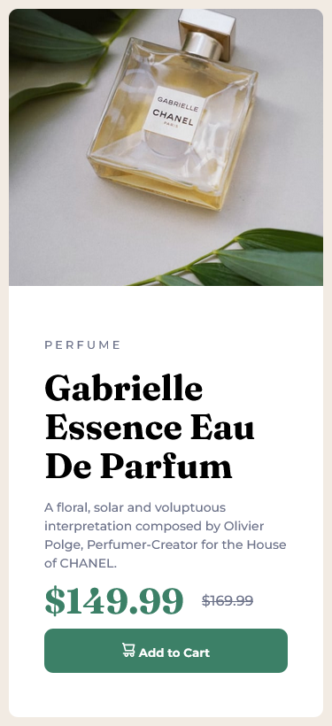

# Frontend Mentor - Product preview card component solution

This is a solution to the [Product preview card component challenge on Frontend Mentor](https://www.frontendmentor.io/challenges/product-preview-card-component-GO7UmttRfa). Frontend Mentor challenges help you improve your coding skills by building realistic projects. 

## Table of contents

- [Overview](#overview)
  - [The challenge](#the-challenge)
  - [Screenshot](#screenshot)
  - [Links](#links)
- [My process](#my-process)
  - [Built with](#built-with)
  - [What I learned](#what-i-learned)
  - [Useful resources](#useful-resources)
- [Author](#author)
- [Acknowledgments](#acknowledgments)

**Note: Delete this note and update the table of contents based on what sections you keep.**

## Overview

### The challenge

Users should be able to:

- View the optimal layout depending on their device's screen size
- See hover and focus states for interactive elements

### Screenshot

Desktop Preview

Mobile Preview

### Links

- Solution URL: [Add solution URL here](https://your-solution-url.com)
- Live Site URL: [Add live site URL here](https://your-live-site-url.com)

## My process

### Built with

- Semantic HTML5 markup
- CSS custom properties
- Flexbox
- Media query

### What I learned

Took me almost 3.5 hours to finish this easy level since I am getting familiar with using flexbox and trying to improve the structure of HTML semantic and the use of CSS. 

### Useful resources

- [ChatGPT](https://chat.openai.com/) - This helped me for finding a specific question. I really liked this pattern and will use it going forward.

## Author

- Website - [Shanice Dawn](https://sdacleofe.github.io/about-me/)
- Frontend Mentor - [@sdacleofe](https://www.frontendmentor.io/profile/sdacleofe)